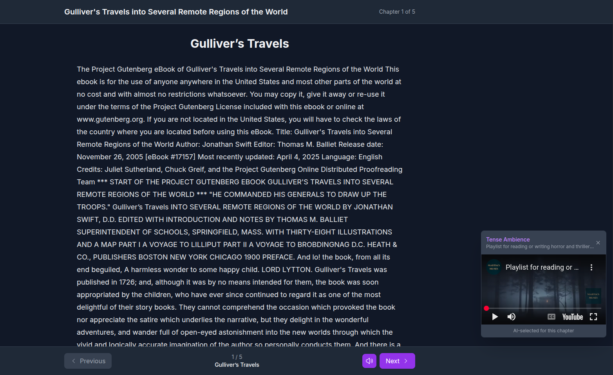

# Sonomancer - Ambient E-Reader

[](https://python.org)
[](https://fastapi.tiangolo.com)
[](https://nextjs.org)
[](https://reactjs.org)
[](https://typescriptlang.org)
[](https://docker.com)
[](https://openai.com)
[](https://developers.google.com/youtube)
[](LICENSE)
[](https://github.com/topics/artificial-intelligence)
[](https://github.com/topics/ebook)

An immersive e-reading experience that uses AI to generate ambient soundscapes matching the mood of each chapter.

## Screenshot

<div align="center">
  
  <p><em>Screenshot of the Sonomancer ambient e-reader in action</em></p>
</div>

## Features

- **Book Upload**: Support for EPUB and PDF files
- **Chapter-by-Chapter Reading**: Clean, dark-mode reading interface
- **AI-Powered Ambience**: Analyzes chapter mood and finds matching YouTube ambient videos
- **Seamless Integration**: Auto-playing ambient videos with cross-fade between chapters
- **Toggle Controls**: Easy on/off controls for ambience without leaving the page

## Tech Stack

- **Frontend**: Next.js 15 with React 19, Tailwind CSS
- **Backend**: Python 3.11 with FastAPI
- **AI Agent**: OpenAI GPT for mood classification
- **Book Parsing**: ebooklib (EPUB), PyMuPDF (PDF)
- **Ambience**: YouTube Data API v3

## Quick Start

1. **Clone and setup**:
   ```bash
   git clone <repository-url>
   cd Sonomancer
   cp .env.example .env
   ```

2. **Configure API keys** in `.env`:
   ```env
   OPENAI_API_KEY=your_openai_api_key_here
   YOUTUBE_API_KEY=your_youtube_api_key_here
   ```

3. **Run with Docker**:
   ```bash
   docker-compose up -d
   ```

4. **Open in browser**: http://localhost:3000

## API Endpoints

| Route | Method | Purpose |
|-------|--------|---------|
| `/upload` | POST | Upload EPUB/PDF, returns `book_id` |
| `/chapters/{book_id}` | GET | List chapter indices + titles |
| `/chapter/{book_id}/{index}` | GET | Get chapter content |
| `/ambience/{book_id}/{index}` | GET | AI analysis → mood + YouTube video ID |

## API Keys Setup

### OpenAI API Key
1. Visit https://platform.openai.com/api-keys
2. Create a new API key
3. Add to `.env` as `OPENAI_API_KEY`

### YouTube Data API Key
1. Go to https://console.developers.google.com/
2. Create a new project or select existing
3. Enable "YouTube Data API v3"
4. Create credentials (API Key)
5. Add to `.env` as `YOUTUBE_API_KEY`

## Development

### Manual Setup (without Docker)

**Backend**:
```bash
cd backend
pip install -r requirements.txt
uvicorn main:app --reload
```

**Frontend**:
```bash
cd sonomancer_frontend
npm install
npm run dev
```

### Project Structure

```
Sonomancer/
├── backend/                 # FastAPI backend
│   ├── main.py             # API routes
│   ├── agent.py            # AI agent for mood analysis
│   ├── parsers.py          # EPUB/PDF parsing
│   ├── requirements.txt    # Python dependencies
│   └── Dockerfile
├── sonomancer_frontend/    # Next.js frontend
│   ├── app/
│   │   ├── components/     # React components
│   │   ├── landing/        # Upload page
│   │   └── reader/         # Reader interface
│   ├── package.json
│   └── Dockerfile
├── docker-compose.yml      # One-command deployment
├── .env.example           # Environment variables template
└── README.md
```

## Usage

1. **Upload**: Drag & drop an EPUB or PDF file
2. **Read**: Navigate through chapters with the bottom controls
3. **Ambience**: AI automatically selects ambient videos for each chapter
4. **Toggle**: Use the speaker icon to turn ambience on/off

## AI Workflow

1. Extract random excerpts from chapter text
2. Classify mood using OpenAI (tense, romantic, mystical, etc.)
3. Search YouTube for long-form ambient videos matching the mood
4. Select best video based on title keywords and relevance
5. Auto-embed and play with cross-fade transitions

## Troubleshooting

- **Upload fails**: Check file format (EPUB/PDF only)
- **No ambience**: Verify API keys in `.env`
- **Video won't play**: Check YouTube video availability and embedding permissions
- **Port conflicts**: Modify ports in `docker-compose.yml` if needed

## License

MIT License - see LICENSE file for details
